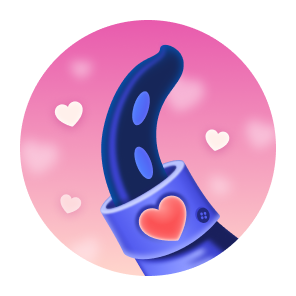
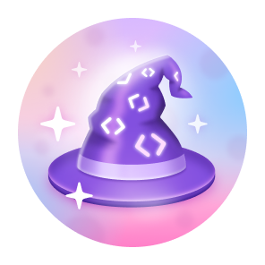
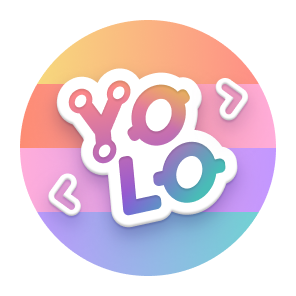
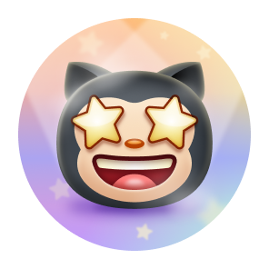
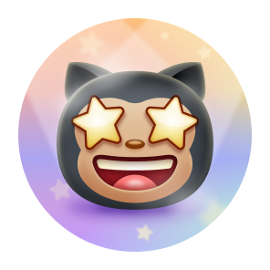
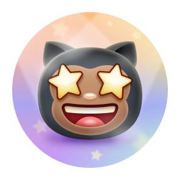
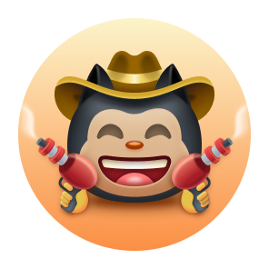

# 🏆 Auto GitHub Achievements & Comprehensive Badge Guide

Welcome to the ultimate repository for GitHub Achievements! This project serves two purposes:
1. 🤖 **An Automated Tool (GitHub Action)** to effortlessly farm specific badges (Pull Shark, YOLO, Quickdraw).
2. 📚 **A Comprehensive Guide** explaining every GitHub badge available, how to earn them, and what they mean.

---

## 🤖 PART 1: The Automation Tool (Badge Farm)

An automated GitHub Actions workflow designed to help you farm specific GitHub profile badges without manual effort. By utilizing GitHub Actions and the GitHub CLI (`gh`), this workflow automatically creates dummy branches, commits, opens Pull Requests, and immediately merges them.

### ✨ Targeted Achievements
*   🦈 **Pull Shark:** Opened a pull request that has been merged. (Farms up to the Gold tier: 1024 PRs).
*   🚀 **YOLO:** Merged a pull request without a code review.
*   🤠 **Quickdraw:** Closed/merged an issue or pull request within 5 minutes of opening.

### ⚙️ How It Works
When triggered (either manually or via a cron schedule), the workflow will:
1. Check out the repository and pull the latest code to prevent conflicts.
2. Create a unique branch based on the current timestamp.
3. Overwrite the `badge-farm-log.txt` file with a new timestamp and commit the change.
4. Open a Pull Request from the new branch to `main`.
5. Instantly squash-merge the PR using its specific URL.
6. Delete the temporary branch to keep the repository clean.

### 🚀 Setup Instructions
**Step 1: Enable GitHub Actions Permissions**
1. Go to your repository's **Settings** > **Actions** > **General**.
2. Scroll down to **Workflow permissions**.
3. Select **Read and write permissions**.
4. Check the box for **Allow GitHub Actions to create and approve pull requests**.
5. Click **Save**.

**Step 2: Add the Workflow**
1. Create a directory structure `.github/workflows/` in your repository.
2. Add the `badge-farm.yml` file generated for this tool.
3. Update the `user.name` and `user.email` in the YAML file to match your GitHub account details.

### 🕹️ Usage
*   **Manual Run:** Go to the **Actions** tab, select the workflow, click **Run workflow**, and input the number of PR loops you want to execute.
*   **Automated Run:** Uncomment the `schedule` (cron) section in the YAML file to let it run daily in the background.

> **⚠️ Anti-Spam Warning:** GitHub has rate limits and abuse detection mechanisms. Do not spam hundreds of PRs in a matter of minutes manually. Run this action at a reasonable pace.

---

## 📚 PART 2: GitHub Achievements & Badges Guide

GitHub offers a variety of badges to celebrate your contributions, engagement, and community-building efforts. These badges can be displayed on your GitHub profile and are available based on different activities.

### 🏅 Displaying Achievements
You can opt to **show or hide** these achievements on your GitHub profile. By default, they are visible to anyone who visits your public profile. If you prefer not to display them, you can modify this setting in your [GitHub Profile Settings](https://github.com/settings).

### 📃 Achievement List
Below is a list of some of the key **GitHub Badges** you can earn and how to get them:

| Badge | Name | How to Earn | Levels (Default, Bronze, Silver, Gold) |
|:-:|:-:|:-:|:-:|
|  | Heart On Your Sleeve | (TBD) |  |
|  | Open Sourcerer | (TBD) |  |
|  | Starstruck | Created a repository with many stars | 16 (Bronze), 128 (Silver), 512 (Gold) |
|  | Quickdraw | Closed an issue/pull request within 5 minutes of opening | 1 (Default) |
|  | Pair Extraordinaire | Coauthored a merged commit | 1 (Default), 10 (Bronze), 24 (Silver), 48 (Gold) |
|  | Pull Shark | Opened a merged pull request | 2 (Default), 16 (Bronze), 128 (Silver), 1024 (Gold) |
|  | Galaxy Brain | Answered a discussion and got an accepted answer | 2 (Default), 8 (Bronze), 16 (Silver), 32 (Gold) |
|  | YOLO | Merged a pull request without a review | 1 (Default) |
|  | Public Sponsor | Sponsored an open-source contributor through GitHub Sponsors | 1 (Default) |

### 👋 Badge Skin Tones
GitHub badges can also be customized with **skin tone preferences** for certain achievements. You can set your preferred skin tone in your [GitHub Appearance Settings](https://github.com/settings/appearance). 

| Badge | Name | Skin Tone Versions | 
| :-: | :-: |:---:|
|  | Starstruck | <table> <tbody> <tr> <td align="center"></td> <td align="center"></td> <td align="center"></td> <td align="center"></td> <td align="center"></td> <td align="center"></td> </tr> <tr> <td align="center">👋</td> <td align="center">👋🏻</td> <td align="center">👋🏼</td> <td align="center">👋🏽</td> <td align="center">👋🏾</td> <td align="center">👋🏿</td> </tr> </tbody> </table> |
|  | Quickdraw | <table> <tbody> <tr> <td align="center"></td> <td align="center"></td> <td align="center"></td> <td align="center"></td> <td align="center"></td> <td align="center"></td> </tr> <tr> <td align="center">👋</td> <td align="center">👋🏻</td> <td align="center">👋🏼</td> <td align="center">👋🏽</td> <td align="center">👋🏾</td> <td align="center">👋🏿</td> </tr> </tbody> </table> |

### ✨ Highlight Badges
In addition to standard badges, GitHub offers special **highlight badges** to mark participation in certain exclusive programs:

<table>
  <tr>
    <td>
      <picture>
        <source media="(prefers-color-scheme: dark)" srcset="https://raw.githubusercontent.com/kavicastelo/Github-Achivements/refs/heads/main/Media/Highlights/GitHub-Pro/SVG/GitHub-Pro_LightMode.svg" />
        <source media="(prefers-color-scheme: light)" srcset="https://raw.githubusercontent.com/kavicastelo/Github-Achivements/refs/heads/main/Media/Highlights/GitHub-Pro/SVG/GitHub-Pro_DarkMode.svg" />
        
      </picture>
    </td>
    <td>GitHub Pro</td>
    <td>Use GitHub Pro</td>
  </tr>
  <tr>
    <td>
      <picture>
        <source media="(prefers-color-scheme: dark)" srcset="https://raw.githubusercontent.com/kavicastelo/Github-Achivements/refs/heads/main/Media/Highlights/Developer-Program-Member/SVG/DeveloperProgramMember_LightMode.svg" />
        <source media="(prefers-color-scheme: light)" srcset="https://raw.githubusercontent.com/kavicastelo/Github-Achivements/refs/heads/main/Media/Highlights/Developer-Program-Member/SVG/DeveloperProgramMember_DarkMode.svg" />
        
      </picture>
    </td>
    <td>Developer Program Member</td>
    <td>Register for the GitHub Developer Program</td>
  </tr>
  <tr>
    <td>
      <picture>
        <source media="(prefers-color-scheme: dark)" srcset="https://raw.githubusercontent.com/kavicastelo/Github-Achivements/refs/heads/main/Media/Highlights/Security-Advisory-Credit/SVG/Security-Advisory-Credit_LightMode.svg" />
        <source media="(prefers-color-scheme: light)" srcset="https://raw.githubusercontent.com/kavicastelo/Github-Achivements/refs/heads/main/Media/Highlights/Security-Advisory-Credit/SVG/Security-Advisory-Credit_DarkMode.svg" />
        
      </picture>
    </td>
    <td>Security Advisory Credit</td>
    <td>Contribute to a security advisory accepted to the GitHub Advisory Database</td>
  </tr>
  <tr>
    <td>
      <picture>
        <source media="(prefers-color-scheme: dark)" srcset="https://raw.githubusercontent.com/kavicastelo/Github-Achivements/refs/heads/main/Media/Highlights/Security-Bug-Bounty-Hunter/SVG/Security-Bug-Bounty-Hunter_LightMode.svg" />
        <source media="(prefers-color-scheme: light)" srcset="https://raw.githubusercontent.com/kavicastelo/Github-Achivements/refs/heads/main/Media/Highlights/Security-Bug-Bounty-Hunter/SVG/Security-Bug-Bounty-Hunter_LightMode.svg" />
        
      </picture>
    </td>
    <td>Security Bug Bounty Hunter</td>
    <td>Participate in GitHub's Security Bug Bounty program</td>
  </tr>
  <tr>
    <td>
      <picture>
        <source media="(prefers-color-scheme: dark)" srcset="https://raw.githubusercontent.com/kavicastelo/Github-Achivements/refs/heads/main/Media/Highlights/GitHub-Campus-Expert/SVG/GitHub-Campus-Expert_LightMode.svg" />
        <source media="(prefers-color-scheme: light)" srcset="https://raw.githubusercontent.com/kavicastelo/Github-Achivements/refs/heads/main/Media/Highlights/GitHub-Campus-Expert/SVG/GitHub-Campus-Expert_LightMode.svg" />
        
      </picture>
    </td>
    <td>GitHub Campus Expert</td>
    <td>Join the GitHub Campus Program</td>
  </tr>
</table>

### ❌ Unavailable or Retired Badges
Some badges are no longer available or can no longer be earned due to the retirement of specific programs:

| Badge | Name | How to Get |
|:-:|:-:|:-:|
|  | Mars 2020 Contributor | Contributed to the Mars 2020 Helicopter Mission repository |
|  | Arctic Code Vault Contributor | Contributed to the 2020 GitHub Archive Program |

### ℹ️ More Information
For more details on how to manage and customize your GitHub profile with badges, check out the official GitHub documentation on [Displaying Badges](https://docs.github.com/en/account-and-profile/setting-up-and-managing-your-github-profile/customizing-your-profile/personalizing-your-profile#displaying-badges-on-your-profile).

### 📋 Credits
Thanks to [Kai](https://github.com/Schweinepriester), [Thinkright](https://github.com/Thinkright20) for the high quality images and original inspiration!

---
*Happy coding, and keep achieving! 🏆*